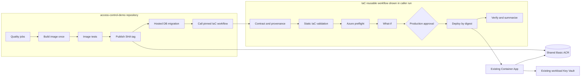
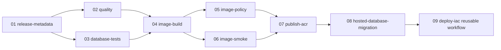
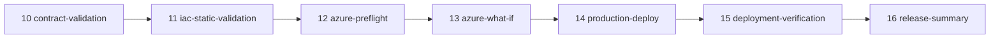

# Azure IaC with ACR: reviewed implementation plan

> **Historical plan (archived).** Written 18 September 2026 as an implementation-ready
> review. It is **not** live repository status. Several “current state” claims inside
> (no ACR yet, Bicep 0.46.1, access-control as first deployed workload) are outdated.
>
> **Authoritative status:** root [README](../../README.md) and
> [reusable-iac-design.md](../reusable-iac-design.md).
>
> **What landed after this plan:** shared ACR platform; Qwik foundation + release path;
> sticky custom domains. **What has not:** this repository still does **not** deploy
> `access-control-demo` — that brownfield migration is next.

Status at authoring time: implementation-ready plan pending user approval and preflight gates

Primary repository: `iac`

Originally targeted first workload: `access-control-demo` (still the next migration; Qwik shipped first as a greenfield proof)

Review date: 18 September 2026

This document supersedes the proposed `iac-acr-implementation-handoff.md` where the two conflict. It is a plan only. It does not authorize an Azure deployment.

## 1. Approved decisions

1. Use Azure Bicep.
2. Use one shared Azure Container Registry (ACR).
3. Start with Basic ACR.
4. Disable the ACR admin account and anonymous pull.
5. Enable `RBAC Registry + ABAC Repository Permissions` when the new registry is created.
6. Build and test images in the application repository.
7. Tag images with the full 40-character Git commit SHA and deploy by digest.
8. Use GitHub OIDC and managed identities. Do not create Azure client secrets.
9. Keep access-gate values in the workload Key Vault. Container Apps resolves them directly.
10. Do not store runtime secret values in GitHub Secrets, workflow inputs, Bicep parameters, repository files, artifacts, outputs, or logs.
11. Migrate `access-control-demo` first.
12. Require Azure `what-if` before production deployment.
13. Keep teardown manual and separate.
14. Show each build, test, planning, deployment, and verification stage as a separate GitHub Actions job.

## 2. Verified current state

The following facts were verified read-only against the connected Azure account and local repositories.

### Azure account

```text
Subscription: braddles-env
Subscription ID: eb1b0038-3a72-459d-884c-ba2820dc53cc
Tenant ID: f1c96730-73a1-4159-81ab-0bb6731c8e75
Location: australiaeast
```

Only one resource group currently exists:

```text
rg-access-control-demo
```

Neither `rg-platform-production` nor `rg-access-control-production` currently exists.

### Existing workload resources

```text
Resource group: rg-access-control-demo
Container Apps environment: aca-access-control-demo
Container App: aca-access-control-demo
Custom domain: aca.braddlesunravels.online
Current image: ghcr.io/braddlesunravels/access-control-demo:f96955251c2dae66e1b6f33a6bd6185e9f2faf2a
Latest revision observed: aca-access-control-demo--0000025
Key Vault: kv-acd-prod-braddles
Runtime secret identity: id-access-control-demo-secrets
Current GitHub identity: github-access-control-demo-production
Log Analytics workspace: log-access-control-demo
Managed certificates: 2
```

The Key Vault already has the required production posture:

```text
RBAC authorization: enabled
Public network access: enabled
Soft-delete retention: 90 days
Purge protection: enabled
```

The current observability route is:

```text
Container Apps stdout/stderr
  -> Azure Monitor resource logs
  -> diagnostic setting
  -> log-access-control-demo
```

The environment uses `azure-monitor`, not the generic IaC module's direct `log-analytics` configuration.

### ACR state

There is no ACR in the subscription. Version 1 therefore creates a new registry in ABAC mode and does not need an RBAC-to-ABAC registry migration.

### Local tooling

```text
Node: 24.14.1 locally; workflows will pin Node 22
npm: 11.12.1
Azure CLI: 2.89.0
Bicep CLI: 0.46.1
shellcheck: not installed locally
checkov: not installed locally
```

The three existing IaC Bicep entry points compile, and the current shell scripts pass `bash -n`.

## 3. Critical review findings

### 3.1 Do not give one release identity workload Contributor plus ACR Writer

The proposed combined release identity could push an image and directly modify the workload resource group, bypassing contract validation, `what-if`, and the reusable workflow. Resource-group Contributor can also alter or delete the environment, Key Vault resource, identities, and observability resources.

Use separate identities:

- publisher/migration identity;
- read-only planner identity;
- narrowly scoped deployer identity;
- runtime identity;
- privileged foundation operator or automation identity.

### 3.2 Production approval belongs in the application repository for `workflow_call`

A reusable workflow runs in the caller's GitHub Actions context. The production environment and required reviewers must therefore be configured in `access-control-demo` when that repository calls `iac/.github/workflows/deploy-workload.yml`.

Do not claim that an IaC-repository environment protects a normal cross-repository `workflow_call`. If central IaC-owned approval is required later, replace the reusable call with a separately triggered workflow in the IaC repository and design authenticated cross-repository dispatch.

### 3.3 OIDC must bind the exact reusable workflow

The default GitHub OIDC subject identifies the caller repository/ref or environment but does not independently enforce the called workflow. GitHub includes `job_workflow_ref`; Azure trust must receive it through a customized `sub` claim.

Before creating production federated credentials:

1. Run a non-destructive OIDC claim pilot.
2. Do not print the raw JWT.
3. Print only approved decoded claims.
4. Configure the repository subject template to include immutable repository IDs, context, and `job_workflow_ref`.
5. Bind planner and deployer credentials to the exact reusable workflow file and pinned commit SHA.
6. Update credentials whenever the pinned IaC workflow SHA changes.

### 3.4 Adopt existing workload resources in place

Do not rename or move the current resource group, Container Apps environment, Container App, Key Vault, Log Analytics workspace, identities, custom domain, or certificates during the ACR migration.

Azure cannot move a Container App between Container Apps environments in place. A different environment ID means a parallel deployment and traffic cutover project.

Version 1 creates only the new shared ACR resource group and registry. It adopts the current workload names in the environment catalog.

### 3.5 Preserve the current logging route

Do not deploy `modules/container-apps-environment/main.bicep` over the current environment in its present form. It uses direct Log Analytics configuration and `listKeys()`, while production currently uses `azure-monitor` plus diagnostic settings.

The access-control foundation must model the current environment and diagnostics exactly before adoption.

### 3.6 Correct the Supabase runtime variable names

The reusable stack currently emits `NEXT_PUBLIC_SUPABASE_URL` and `NEXT_PUBLIC_SUPABASE_PUBLISHABLE_KEY`. The application uses:

```text
NEXT_SUPABASE_URL
NEXT_SUPABASE_PUBLISHABLE_KEY
```

The migrated stack must preserve the latter names and test them in the deployed revision.

### 3.7 Keep hosted Supabase migration visible and protected

The current production workflow applies hosted Supabase migrations before deployment. That behavior cannot disappear during an infrastructure refactor.

Use a separate `hosted-database-migration` job. Migration credentials are operational secrets, not Container App runtime values. Recommended version 1 handling:

- store `supabase-access-token` and `supabase-db-password` in the application Key Vault;
- grant the publisher/migration identity read access only to those two secret scopes;
- fetch them just in time after OIDC login;
- immediately mask them with `::add-mask::`;
- keep them out of job outputs, artifacts, summaries, command arguments where practical, and GitHub Secrets;
- unset them after the migration job.

Access-gate values are never fetched by GitHub; Container Apps resolves them directly through Key Vault references.

### 3.8 A reviewed `what-if` is not an applyable plan

Azure `what-if` does not produce an applyable plan artifact. Bind review to immutable inputs instead:

- caller repository ID and commit SHA;
- IaC workflow repository and commit SHA;
- environment catalog hash;
- workload contract hash;
- image digest;
- target subscription and resource group.

Publish those values with the `what-if`. The deploy job must revalidate them and rerun `what-if` immediately before `az deployment group create`.

### 3.9 ACR managed-identity pull has an additional prerequisite

The registry must permit ARM-audience authentication tokens. Configure and verify:

```text
policies.azureADAuthenticationAsArmPolicy.status = enabled
```

Without this, Container Apps managed-identity pulls can fail even when RBAC is correct.

### 3.10 The first migration should not refactor every generic stack

Implement an access-control-specific foundation and release stack first. Do not redesign PostgreSQL or force the Qwik/Elysia stack through a new interface merely to keep every experimental entry point compiling.

Mark that stack unsupported for production and exclude it from production workflow validation until it receives its own reviewed plan.

## 4. Final architecture



### Resource groups

Version 1 target:

```text
rg-platform-production
  new shared Basic ACR

rg-access-control-demo
  adopted Log Analytics workspace
  adopted Container Apps environment
  adopted Container App
  adopted Key Vault
  adopted runtime identity
  adopted managed certificates
```

Do not introduce `rg-access-control-production` during this migration. A later resource-group normalization requires a separate parallel migration plan.

## 5. Identity and permission specification

### 5.1 Privileged foundation operator

Version 1 recommendation: use a trusted human operator rather than creating another automated privileged identity.

Responsibilities:

- create `rg-platform-production`;
- create ACR;
- create publisher, planner, and deployer identities;
- configure federated credentials;
- create custom role definitions and assignments;
- grant ACR ABAC roles;
- maintain Key Vault role assignments;
- adopt stable workload resources.

Required privilege is time-bound and narrowly scoped. Do not grant this privilege to routine workflows.

### 5.2 Publisher/migration identity

Suggested name:

```text
id-access-control-production-publisher
```

Assignments:

- `Container Registry Repository Writer` at the shared ACR, with an exact `access-control-demo` repository condition;
- `Key Vault Secrets User` at the individual secret scopes for `supabase-access-token` and `supabase-db-password`, not at whole-vault scope.

It has no Azure resource-group Contributor role and cannot deploy infrastructure.

### 5.3 Planner identity

Suggested name:

```text
id-access-control-production-planner
```

Assignments:

- a custom read/what-if role at `rg-access-control-demo`;
- `Reader` at the shared ACR if the template preflight requires registry metadata.

Minimum custom-role intent:

```json
{
  "Name": "Access Control Deployment Planner",
  "Actions": [
    "Microsoft.Resources/subscriptions/resourceGroups/read",
    "Microsoft.Resources/deployments/read",
    "Microsoft.Resources/deployments/validate/action",
    "Microsoft.Resources/deployments/whatIf/action",
    "Microsoft.Resources/deployments/operations/read",
    "Microsoft.App/containerApps/read",
    "Microsoft.App/managedEnvironments/read",
    "Microsoft.App/managedEnvironments/managedCertificates/read",
    "Microsoft.ManagedIdentity/userAssignedIdentities/read",
    "Microsoft.KeyVault/vaults/read",
    "Microsoft.OperationalInsights/workspaces/read",
    "Microsoft.Insights/diagnosticSettings/read"
  ],
  "NotActions": [],
  "DataActions": [],
  "NotDataActions": []
}
```

The implementation agent must validate this list with an actual `what-if`; add only the denied read or deployment action reported by Azure.

### 5.4 Deployer identity

Suggested name:

```text
id-access-control-production-deployer
```

Assignments:

- a custom workload deployment role at `rg-access-control-demo`;
- identity assignment permission scoped only to `id-access-control-demo-secrets`;
- `Reader` at the shared ACR if deployment validation requires it.

Minimum custom-role intent:

```json
{
  "Name": "Access Control Container App Deployer",
  "Actions": [
    "Microsoft.Resources/subscriptions/resourceGroups/read",
    "Microsoft.Resources/deployments/read",
    "Microsoft.Resources/deployments/write",
    "Microsoft.Resources/deployments/validate/action",
    "Microsoft.Resources/deployments/whatIf/action",
    "Microsoft.Resources/deployments/operations/read",
    "Microsoft.App/containerApps/read",
    "Microsoft.App/containerApps/write",
    "Microsoft.App/managedEnvironments/read",
    "Microsoft.App/managedEnvironments/managedCertificates/read",
    "Microsoft.ManagedIdentity/userAssignedIdentities/read",
    "Microsoft.KeyVault/vaults/read",
    "Microsoft.OperationalInsights/workspaces/read",
    "Microsoft.Insights/diagnosticSettings/read"
  ],
  "NotActions": [
    "Microsoft.App/containerApps/listSecrets/action"
  ],
  "DataActions": [],
  "NotDataActions": []
}
```

Also assign `Managed Identity Operator` at the runtime identity resource scope, or include only `Microsoft.ManagedIdentity/userAssignedIdentities/assign/action` at that scope in a dedicated custom role.

Do not grant Contributor. The deployment stack must not contain role assignments, Key Vault writes, identity creation, environment writes, certificate writes, or diagnostic-setting writes.

### 5.5 Runtime identity

Reuse:

```text
id-access-control-demo-secrets
```

Assignments:

- existing `Key Vault Secrets User` on `kv-acd-prod-braddles`;
- new `Container Registry Repository Reader` on ACR, conditioned to repository `access-control-demo`.

Attach the identity to the Container App and use it for both:

- `configuration.registries[].identity`;
- every `configuration.secrets[].identity` Key Vault reference.

### 5.6 Existing GitHub identity

Do not silently delete `github-access-control-demo-production`. Inventory its federated credentials and assignments first. Prefer repurposing it as the planner only if its client ID and subject migration can be done without breaking rollback. Otherwise retain it temporarily for rollback and remove it after acceptance.

## 6. Secret and configuration contract

### Never stored in GitHub

```text
ACCESS_GATE_CODE_SECRET
ACCESS_GATE_COOKIE_SECRET
SUPABASE_ACCESS_TOKEN
SUPABASE_DB_PASSWORD
```

### Direct Container Apps Key Vault references

```text
access-gate-code-secret
access-gate-cookie-secret
```

Use versionless URIs so rotation is picked up automatically:

```text
https://kv-acd-prod-braddles.vault.azure.net/secrets/access-gate-code-secret
https://kv-acd-prod-braddles.vault.azure.net/secrets/access-gate-cookie-secret
```

### Just-in-time migration retrieval

```text
supabase-access-token
supabase-db-password
```

These are read only in the protected migration job. They are not Container App runtime settings.

### Non-secret catalog values

Azure subscription and tenant IDs, managed identity client IDs, resource IDs, Supabase project URL, Supabase publishable key, resource names, and custom-domain names are identifiers/configuration rather than credentials. Store them in the reviewed environment catalog, not GitHub Secrets.

## 7. Repository structure

```text
.github/workflows/
  validate.yml
  deploy-platform.yml
  deploy-workload-foundation.yml
  deploy-workload.yml
  teardown-workload.yml

docs/plans/
  iac-acr-reviewed-implementation-plan.md

docs/
  reusable-iac-design.md
  operations.md
  migration-access-control-demo.md

environments/
  production.json

examples/contracts/
  access-control-demo.production.json

foundations/access-control-demo/
  main.bicep
  main.example.bicepparam

modules/
  container-app/
  container-registry/
  key-vault/
  managed-identity/
  role-assignment/
  existing modules retained as needed

roles/
  access-control-deployment-planner.json
  access-control-container-app-deployer.json

schemas/
  environment.schema.json
  workload.schema.json

scripts/
  bootstrap-platform.sh
  bootstrap-workload.sh
  deploy-platform.sh
  deploy-workload.sh
  render-deployment-parameters.mjs
  set-production-secrets.sh
  validate-contract.mjs
  validate-environment.mjs
  verify-image.mjs

tests/
  contract-validator.test.mjs
  environment-validator.test.mjs
  image-validator.test.mjs
  fixtures/

stacks/access-control-demo/
  main.bicep
  main.example.bicepparam
```

Leave `stacks/qwik-elysia-postgres` present but production-disabled. Do not adapt it in this delivery unless a shared module change otherwise breaks static compilation; if that occurs, preserve its behavior without claiming production support.

## 8. Environment catalog specification

Create `environments/production.json` only after the preflight inventory is approved.

```json
{
  "$schema": "../schemas/environment.schema.json",
  "schemaVersion": 1,
  "name": "production",
  "azure": {
    "subscriptionId": "eb1b0038-3a72-459d-884c-ba2820dc53cc",
    "tenantId": "f1c96730-73a1-4159-81ab-0bb6731c8e75",
    "location": "australiaeast",
    "platformResourceGroup": "rg-platform-production",
    "containerRegistryName": "<generated-and-approved-name>",
    "containerRegistryLoginServer": "<same-name>.azurecr.io",
    "containerRegistryRoleAssignmentMode": "AbacRepositoryPermissions"
  },
  "workloads": {
    "access-control-demo": {
      "resourceGroup": "rg-access-control-demo",
      "stack": "access-control-demo",
      "repository": "braddlesunravels/access-control-demo",
      "containerRepository": "access-control-demo",
      "containerAppsEnvironmentName": "aca-access-control-demo",
      "containerAppName": "aca-access-control-demo",
      "logAnalyticsWorkspaceName": "log-access-control-demo",
      "keyVaultName": "kv-acd-prod-braddles",
      "runtimeIdentityName": "id-access-control-demo-secrets",
      "publisherIdentityName": "id-access-control-production-publisher",
      "plannerIdentityName": "id-access-control-production-planner",
      "deployerIdentityName": "id-access-control-production-deployer",
      "customDomainName": "aca.braddlesunravels.online",
      "certificateResourceId": "<verified-existing-managed-certificate-id>",
      "allowedSecretNames": [
        "access-gate-code-secret",
        "access-gate-cookie-secret"
      ],
      "migrationSecretNames": [
        "supabase-access-token",
        "supabase-db-password"
      ],
      "bounds": {
        "targetPorts": [3000],
        "minReplicas": { "minimum": 1, "maximum": 1 },
        "maxReplicas": { "minimum": 1, "maximum": 1 },
        "healthProbePaths": ["/api/health"],
        "cpu": ["0.25"],
        "memory": ["0.5Gi"]
      }
    }
  }
}
```

The schema must reject unknown properties and cross-check the ACR login server against the registry name.

## 9. Application workload contract

Add `access-control-demo/.azure/workload.production.json`:

```json
{
  "$schema": "https://raw.githubusercontent.com/braddlesunravels/iac/<PINNED_SHA>/schemas/workload.schema.json",
  "schemaVersion": 1,
  "application": "access-control-demo",
  "stack": "access-control-demo",
  "environment": "production",
  "container": {
    "targetPort": 3000,
    "healthProbePath": "/api/health",
    "cpu": "0.25",
    "memory": "0.5Gi",
    "minReplicas": 1,
    "maxReplicas": 1
  },
  "env": {
    "NODE_ENV": "production",
    "NEXT_TELEMETRY_DISABLED": "1",
    "HOSTNAME": "0.0.0.0",
    "PORT": "3000",
    "ACCESS_GATE_DISABLED": "false"
  },
  "secretRefs": {
    "ACCESS_GATE_CODE_SECRET": "access-gate-code-secret",
    "ACCESS_GATE_COOKIE_SECRET": "access-gate-cookie-secret"
  },
  "customDomain": {
    "enabled": true
  }
}
```

The contract must not contain Azure coordinates, Key Vault URLs, certificate IDs, image references, Supabase credentials, or secret values.

`NEXT_SUPABASE_URL` and `NEXT_SUPABASE_PUBLISHABLE_KEY` should be resolved from the central catalog or existing non-secret environment configuration, then emitted with those exact names.

## 10. Bicep specifications

### 10.1 ACR module

Use stable API `Microsoft.ContainerRegistry/registries@2025-11-01`.

```bicep
@description('Globally unique ACR name.')
param name string

@description('Azure region.')
param location string

@description('Resource tags.')
param tags object = {}

resource registry 'Microsoft.ContainerRegistry/registries@2025-11-01' = {
  name: name
  location: location
  tags: tags
  sku: {
    name: 'Basic'
  }
  properties: {
    adminUserEnabled: false
    anonymousPullEnabled: false
    publicNetworkAccess: 'Enabled'
    roleAssignmentMode: 'AbacRepositoryPermissions'
    policies: {
      azureADAuthenticationAsArmPolicy: {
        status: 'enabled'
      }
    }
  }
}

output id string = registry.id
output name string = registry.name
output loginServer string = registry.properties.loginServer
output location string = registry.location
output roleAssignmentMode string = registry.properties.roleAssignmentMode
```

Compile this against Bicep 0.46.1 and confirm the exact enum casing from the resource schema before deployment.

### 10.2 ACR ABAC role assignment

Use the full ACR resource ID as scope. Use `conditionVersion: '2.0'`. Keep the repository condition fixed in the privileged foundation template, never supplied by the application contract.

The Reader condition must cover every Reader data action. The current Microsoft example for an exact repository is:

```text
(
 (
  !(ActionMatches{'Microsoft.ContainerRegistry/registries/repositories/content/read'})
  AND
  !(ActionMatches{'Microsoft.ContainerRegistry/registries/repositories/metadata/read'})
 )
 OR
 (
  @Request[Microsoft.ContainerRegistry/registries/repositories:name] StringEqualsIgnoreCase 'access-control-demo'
 )
)
```

Do not derive the Writer expression by guesswork. Generate it with the Azure portal condition editor by selecting all Writer actions, compare it with current Microsoft documentation, save the exact expression as a tested Bicep multiline string, and add a negative repository access test.

Resolve and record the current built-in role-definition GUIDs during implementation. Do not copy guessed IDs into source.

### 10.3 Key Vault module

Remove secret-value parameters and secret resources. Required configuration:

```text
enableRbacAuthorization: true
enableSoftDelete: true
softDeleteRetentionInDays: 90
enablePurgeProtection: true
publicNetworkAccess: Enabled
networkAcls.defaultAction: Allow
```

For the first migration, model `kv-acd-prod-braddles` as existing in the routine stack. Any foundation adoption must show no replacement in `what-if`.

### 10.4 Container App module/stack

The first release stack may be workload-specific. It must:

- treat environment, runtime identity, Key Vault, Log Analytics workspace, and certificate as existing;
- attach the runtime identity;
- configure ACR with the runtime identity and no username/password;
- accept only a validated digest reference;
- use versionless Key Vault references;
- emit exact runtime environment names;
- preserve custom-domain binding;
- preserve startup, liveness, and readiness probes;
- preserve `Single` revision mode and one replica;
- preserve `allowInsecure: false`;
- avoid role assignments and stable foundation writes.

Core secret shape:

```bicep
secrets: [
  {
    name: 'access-gate-code-secret'
    keyVaultUrl: '${keyVault.properties.vaultUri}secrets/access-gate-code-secret'
    identity: runtimeIdentity.id
  }
  {
    name: 'access-gate-cookie-secret'
    keyVaultUrl: '${keyVault.properties.vaultUri}secrets/access-gate-cookie-secret'
    identity: runtimeIdentity.id
  }
]
```

Core registry shape:

```bicep
registries: [
  {
    server: containerRegistryLoginServer
    identity: runtimeIdentity.id
  }
]
```

The deployment outputs must include:

```text
applicationName
applicationFqdn
applicationUrl
latestRevisionName
imageReference
containerAppsEnvironmentName
logAnalyticsWorkspaceName
diagnosticSettingName
```

## 11. Validation tooling

Add Node 22 tooling with pinned `ajv` and `ajv-formats` dependencies and Node's built-in test runner.

Required commands:

```json
{
  "scripts": {
    "test": "node --test tests/*.test.mjs",
    "validate:environment": "node scripts/validate-environment.mjs environments/production.json",
    "validate:examples": "node scripts/validate-contract.mjs examples/contracts/access-control-demo.production.json environments/production.json",
    "validate:bicep": "node scripts/validate-bicep.mjs",
    "validate": "npm test && npm run validate:environment && npm run validate:examples && npm run validate:bicep"
  }
}
```

Validators must fail before Azure login for:

- unknown application, stack, environment, or property;
- caller repository or repository ID mismatch;
- production selection of `qwik-elysia-postgres`;
- arbitrary subscription, tenant, resource group, resource ID, Key Vault URL, certificate ID, ACR host, or image host in a workload contract;
- unapproved environment variable or secret name;
- duplicate or case-conflicting environment variables;
- invalid port, probe, CPU, memory, or replica setting;
- mutable tag, wrong registry, wrong repository, SHA mismatch, malformed digest, or tag/digest mismatch;
- any rendered parameter named or shaped like a secret value.

Use `runner.temp` for rendered parameters and machine-readable `what-if`; never use the repository workspace for generated deployment files.

## 12. Visible GitHub Actions design

### 12.1 Application release workflow job graph

Every item below is a separate GitHub Actions job and therefore a separate visible block.



Job requirements:

| Job | Purpose | Azure identity | Persistent secrets |
| --- | --- | --- | --- |
| `release-metadata` | Validate tag and full SHA; create release manifest | none | none |
| `quality` | Format, type-check, lint, unit tests, Next build | none | none |
| `database-tests` | Local Supabase reset, RLS tests, schema drift | none | none |
| `image-build` | Build once; export compressed OCI/Docker artifact | none | none |
| `image-policy` | Verify linux/amd64, non-root user, no dev packages | none | none |
| `image-smoke` | Load same artifact; run health and auth smoke tests | none | test-only generated values |
| `publish-acr` | OIDC login; push SHA tag; resolve digest | publisher | none |
| `hosted-database-migration` | Protected job; fetch migration secrets from Key Vault; push and verify migrations | publisher/migration | none in GitHub |
| `deploy-iac` | Call pinned reusable workflow with digest and immutable metadata | planner/deployer inside called jobs | none |

Use artifacts to move the exact image built once between jobs. Set short retention. Verify the archive checksum at every consumer. Never rebuild in the publish job.

### 12.2 Reusable IaC workflow job graph

Every item below is a separate job in `.github/workflows/deploy-workload.yml` and appears in the caller run.



#### `contract-validation`

- Checkout caller repository.
- Checkout IaC repository with:

```yaml
- uses: actions/checkout@<PINNED_SHA>
  with:
    repository: ${{ job.workflow_repository }}
    ref: ${{ job.workflow_sha }}
    path: iac
```

- Verify `job.workflow_repository`, `job.workflow_sha`, and `job.workflow_file_path`.
- Validate caller repository ID, owner ID, commit, tag, contract, catalog, image tag, and digest.
- Publish only non-secret validated outputs.

#### `iac-static-validation`

- Install Node 22 and `npm ci` in the IaC checkout.
- Run validator tests.
- Build only production-supported Bicep entry points.
- Run ShellCheck and Checkov at pinned versions.
- Fail on Bicep warnings.

#### `azure-preflight`

- Request OIDC as the planner identity.
- Verify tenant, subscription, target resource group, ACR properties, ARM-token policy, existing environment, app, vault, identity, domain, certificate, diagnostics, and role assignments.
- Fail on any catalog/live mismatch.

#### `azure-what-if`

- Use planner identity.
- Render parameters under `${{ runner.temp }}`.
- Run `az deployment group what-if --result-format FullResourcePayloads`.
- Fail on delete, replace, environment ID change, certificate removal, identity removal, Key Vault mutation, diagnostic removal, or changes outside the Container App release surface.
- Upload redacted JSON with short retention.
- Write the immutable input manifest and readable changes to the job summary.

#### `production-deploy`

- Declare `environment: production`; approval is configured in `access-control-demo`.
- Use the deployer identity and its exact reusable-workflow OIDC subject.
- Revalidate all hashes and live targets.
- Rerun `what-if` and enforce the same deny rules.
- Deploy incrementally with a unique name.
- Never use complete deployment mode.

#### `deployment-verification`

- Verify deployment outputs.
- Verify active revision is healthy.
- Verify configured image digest equals the published digest.
- Verify ACR registry identity is the runtime identity.
- Verify Key Vault references and attached identity without reading values.
- Verify custom-domain HTTPS and certificate.
- Verify `/api/health`, access-gate rejection, and authenticated application smoke behavior.
- Verify Azure Monitor destination and diagnostic setting.

#### `release-summary`

Always run. Publish:

```text
caller repository and commit
caller tag
IaC repository and commit
contract and catalog hashes
image SHA tag and digest
Azure deployment name
subscription and resource group
Container App revision
custom URL
what-if result
migration result
health result
rollback image digest
```

Do not include secret names beyond approved inventory and never include secret values.

### 12.3 Workflow skeleton

```yaml
name: Deploy workload

on:
  workflow_call:
    inputs:
      environment:
        required: true
        type: string
      contract-path:
        required: true
        type: string
      caller-sha:
        required: true
        type: string
      image-tag:
        required: true
        type: string
      image-digest:
        required: true
        type: string

permissions:
  contents: read

jobs:
  contract-validation:
    name: 10 / Contract and provenance
    runs-on: ubuntu-latest
    steps: []

  iac-static-validation:
    name: 11 / IaC static validation
    needs: contract-validation
    runs-on: ubuntu-latest
    steps: []

  azure-preflight:
    name: 12 / Azure target preflight
    needs: iac-static-validation
    permissions:
      contents: read
      id-token: write
    runs-on: ubuntu-latest
    steps: []

  azure-what-if:
    name: 13 / Azure what-if
    needs: azure-preflight
    permissions:
      contents: read
      id-token: write
    runs-on: ubuntu-latest
    steps: []

  production-deploy:
    name: 14 / Approved production deploy
    needs: azure-what-if
    environment:
      name: ${{ inputs.environment }}
    permissions:
      contents: read
      id-token: write
    runs-on: ubuntu-latest
    steps: []

  deployment-verification:
    name: 15 / Production verification
    needs: production-deploy
    permissions:
      contents: read
      id-token: write
    runs-on: ubuntu-latest
    steps: []

  release-summary:
    name: 16 / Release summary
    if: ${{ always() }}
    needs:
      - contract-validation
      - iac-static-validation
      - azure-preflight
      - azure-what-if
      - production-deploy
      - deployment-verification
    runs-on: ubuntu-latest
    steps: []
```

Do not use `secrets: inherit`. Azure client IDs are selected from the reviewed catalog. Tenant and subscription IDs are also catalog values. No client secret exists.

## 13. Workflow pinning and OIDC

### Action pinning

Pin every third-party action to a full commit SHA and comment the intended release:

```yaml
- uses: actions/checkout@<FULL_SHA> # v6.x
- uses: actions/setup-node@<FULL_SHA> # v7.x
- uses: actions/upload-artifact@<FULL_SHA> # v4.x
- uses: actions/download-artifact@<FULL_SHA> # v5.x
- uses: azure/login@<FULL_SHA> # v3.x
```

### Reusable workflow pinning

The application caller uses a full IaC commit SHA:

```yaml
uses: braddlesunravels/iac/.github/workflows/deploy-workload.yml@<FULL_IAC_SHA>
```

A release tag may be documented for humans, but production calls the immutable SHA.

### OIDC pilot

Create a temporary non-destructive workflow that requests an ID token and decodes only:

```text
iss
aud
sub
repository
repository_id
repository_owner
repository_owner_id
environment
workflow_ref
job_workflow_ref
ref
sha
```

Never log the raw token, signature, `jti`, or access token. Approve the final subject format before creating publisher, planner, migration, or deployer credentials.

## 14. File-by-file implementation plan

### Phase 1: planning and validation foundation

Create:

- `package.json`
- `package-lock.json`
- `schemas/environment.schema.json`
- `schemas/workload.schema.json`
- `scripts/validate-environment.mjs`
- `scripts/validate-contract.mjs`
- `scripts/verify-image.mjs`
- `tests/environment-validator.test.mjs`
- `tests/contract-validator.test.mjs`
- `tests/image-validator.test.mjs`
- all positive and negative fixtures
- `.github/workflows/validate.yml`

Update:

- `README.md`
- `docs/reusable-iac-design.md`
- `bicepconfig.json`

Gate:

- tests pass;
- schemas reject every unsafe fixture;
- current production values can be represented without secrets;
- no Azure login occurs in validation.

### Phase 2: fail-closed corrections and shared ACR

Update:

- `modules/container-registry/main.bicep`
- `modules/naming/main.bicep`
- `platform/main.bicep`
- rename `platform/main.bicepparam` to `platform/main.example.bicepparam`
- `scripts/deploy-platform.sh`

Create:

- `environments/production.json`
- `.github/workflows/deploy-platform.yml`
- `docs/operations.md`

Gate before mutation:

- approve generated globally unique ACR name;
- approve `rg-platform-production` creation;
- Bicep build clean;
- Checkov clean or narrowly documented suppressions;
- subscription-scope/resource-group `what-if` reviewed.

Post-deploy checks:

- Basic SKU;
- admin disabled;
- anonymous pull disabled;
- public network enabled;
- ABAC mode enabled;
- ARM-audience policy enabled;
- no credentials emitted.

### Phase 3: identities and foundation adoption

Create:

- `modules/managed-identity/main.bicep`
- condition-capable privileged role-assignment module or explicit foundation assignments
- `roles/access-control-deployment-planner.json`
- `roles/access-control-container-app-deployer.json`
- `foundations/access-control-demo/main.bicep`
- `foundations/access-control-demo/main.example.bicepparam`
- `scripts/bootstrap-platform.sh`
- `scripts/bootstrap-workload.sh`
- `.github/workflows/deploy-workload-foundation.yml`
- `docs/migration-access-control-demo.md`

Update:

- `modules/key-vault/main.bicep` to remove secret creation and enforce hardened defaults;
- `scripts/set-production-secrets.sh` with subscription/vault verification.

Gate:

- actual OIDC claims approved;
- role definitions verified;
- current role assignments inventoried;
- existing certificate resource ID selected;
- foundation `what-if` shows no replacement or deletion of existing workload resources;
- negative ACR repository tests pass;
- runtime identity still resolves Key Vault references.

### Phase 4: routine release stack

Create:

- `stacks/access-control-demo/main.bicep`
- `stacks/access-control-demo/main.example.bicepparam`
- `scripts/render-deployment-parameters.mjs`
- `scripts/deploy-workload.sh`
- `.github/workflows/deploy-workload.yml`

Update or defer:

- update generic `modules/container-app/main.bicep` only if the workload-specific stack cannot safely express the release;
- remove routine ACR role-assignment creation from production-supported stacks;
- mark `qwik-elysia-postgres` unsupported for production.

Gate:

- static validation clean;
- deployment script accepts only allow-listed application/environment and validated digest;
- routine template changes only the Container App release surface;
- parity tests prove exact environment names, probes, domain, identities, logs, and scale.

### Phase 5: application integration

Create in `access-control-demo`:

- `.azure/workload.production.json`

Refactor:

- `.github/workflows/production.yml` into the numbered visible job graph;
- preserve all existing quality, database, image, migration, and smoke checks;
- replace GHCR publication with private ACR publication;
- call the IaC workflow at a full commit SHA.

Update:

- `docs/deployment.md`
- `docs/secrets-management.md`

Do not delete yet:

- `deploy/azure/main.bicep`
- existing bootstrap/rollback scripts;
- known-good GHCR image.

Gate:

- dry run reaches validation and what-if without deployment;
- protected production environment has required reviewers, no self-review, and tag restrictions;
- all jobs appear as separate blocks in the GitHub run.

### Phase 6: production migration

1. Record complete pre-migration inventory.
2. Record current healthy revision and GHCR digest.
3. Push the same known-good code image to ACR by SHA and record digest.
4. Test publisher positive access to `access-control-demo`.
5. Test publisher negative access to another repository.
6. Test runtime positive pull from `access-control-demo`.
7. Test runtime negative pull from another repository.
8. Ensure Supabase migrations are backward-compatible and backup/recovery is available.
9. Run visible hosted migration job.
10. Run planner preflight and `what-if`.
11. Stop on any unexpected delete, replace, environment change, identity removal, certificate change, Key Vault mutation, or diagnostic change.
12. Approve the production deployment job.
13. Rerun `what-if` and deploy by digest.
14. Verify revision, digest, health, custom TLS, access gate, Supabase behavior, and diagnostics.
15. Keep the old GHCR revision/rollback reference until acceptance.
16. Observe logs and health for an agreed soak period.
17. Mark ACR release accepted.

### Phase 7: cleanup after acceptance

Only after the soak period:

- remove obsolete broad role assignments;
- retire or repurpose the old GitHub identity;
- remove GHCR-specific workflow logic;
- archive application-owned Bicep after the IaC stack is proven equivalent;
- retain rollback documentation;
- tag IaC `v1` and keep callers pinned to the accepted commit SHA.

## 15. Teardown specification

Create `.github/workflows/teardown-workload.yml` as manual-only.

Visible jobs:

```text
01 inventory
02 deletion-preview
03 protected-approval
04 targeted-delete
05 absence-verification
06 teardown-summary
```

Rules:

- exact confirmation phrase includes application and environment;
- shared ACR is never deleted;
- Key Vault is retained by default;
- managed certificates are retained unless explicitly selected;
- no resource-group deletion when unknown resources exist;
- delete only allow-listed resources;
- use a dedicated teardown identity or trusted operator, not the routine deployer;
- publish inventory and results without secret values.

## 16. CI validation specification

The IaC validation workflow has separate visible jobs:

```text
01 schema-tests
02 contract-tests
03 bicep-build
04 shell-validation
05 security-scan
06 examples
07 validation-summary
```

Required checks:

```bash
npm ci
npm test
npm run validate:environment
npm run validate:examples
az bicep build --file platform/main.bicep
az bicep build --file foundations/access-control-demo/main.bicep
az bicep build --file stacks/access-control-demo/main.bicep
shellcheck scripts/*.sh
bash -n scripts/*.sh
checkov -d .
```

Pin Node, Bicep, ShellCheck, Checkov, and all actions. CI must fail on Bicep warnings; implement this by capturing build output and rejecting warning diagnostics because Bicep CLI warning exit behavior is not sufficient by itself.

## 17. Acceptance criteria

### Repository

- Every stage is a separate named GitHub Actions job.
- IaC reusable jobs are visible in the application workflow run.
- All external actions and reusable workflows are SHA-pinned.
- No `secrets: inherit`.
- Generated parameters use runner temp and are never committed.
- Production PostgreSQL stack selection is rejected.

### Security

- No Azure client secrets.
- No runtime or migration values stored in GitHub Secrets.
- Access-gate values never enter a GitHub runner.
- ACR admin and anonymous pull are disabled.
- ACR is ABAC-enabled and ARM-token authentication is enabled.
- Publisher can write only `access-control-demo`.
- Runtime can read only `access-control-demo` and its workload vault.
- Planner cannot deploy.
- Deployer cannot create role assignments, modify ACR, write Key Vault, create identities, or alter the Container Apps environment.
- Application contract cannot redirect deployment.

### Migration parity

- Existing resource IDs remain unchanged unless an approved exception exists.
- Existing custom domain and certificate remain valid.
- Existing Azure Monitor and diagnostic configuration remains intact.
- Runtime variables are exactly `NEXT_SUPABASE_URL` and `NEXT_SUPABASE_PUBLISHABLE_KEY`.
- All three health probes remain on `/api/health`.
- Production remains one minimum and one maximum replica.
- Hosted migration remains verified.
- Access gate and Supabase behavior remain unchanged.
- Deployed digest equals tested/published digest.

### Operations

- `what-if` summary contains immutable input hashes.
- Deploy reruns `what-if` immediately before mutation.
- Concurrency prevents overlapping production releases.
- Release summary contains complete provenance.
- Rollback to the recorded GHCR or prior ACR digest is documented and tested.

## 18. Stop conditions

Stop and request user approval if any of the following occurs:

- proposed ACR name or resource group differs from the approved catalog;
- live resource inventory differs from the recorded baseline;
- existing resource replacement or deletion appears;
- Container Apps environment ID changes;
- managed certificate or domain binding changes;
- Key Vault or runtime identity replacement appears;
- diagnostic settings are removed or rerouted;
- a role requires broader scope than specified;
- OIDC claim format does not contain the expected immutable IDs and workflow reference;
- ACR ABAC negative access tests fail;
- secret values appear in logs, artifacts, outputs, parameters, or repository files;
- hosted migration is not backward-compatible;
- deployment digest differs from the tested digest;
- health, TLS, access gate, Supabase, or logging verification fails.

## 19. Remaining approvals before implementation

The following are the only user decisions still required before Azure mutation:

1. Approve retaining `rg-access-control-demo` and all existing workload resource names for version 1.
2. Approve creating `rg-platform-production` for the new shared ACR.
3. Approve the generated globally unique ACR name after availability check.
4. Approve production environment ownership in `access-control-demo` with required reviewers and no self-review.
5. Approve storing Supabase migration credentials in `kv-acd-prod-braddles` and fetching them just in time through OIDC.
6. Approve keeping production fixed at one replica during migration.
7. Identify the trusted operator principal for foundation and secret administration.
8. Approve the exact managed certificate resource ID after the two existing certificates are reconciled.

## 20. Estimate

Assuming prompt approval of the remaining gates:

| Phase | Estimate |
| --- | ---: |
| Validation schemas, tests, and CI | 1.5-2 days |
| Shared ACR and platform workflow | 1-1.5 days |
| Identity/OIDC and foundation adoption | 2-3 days |
| Routine release stack and reusable workflow | 2-3 days |
| Application visible-job refactor | 1.5-2.5 days |
| Migration, verification, and documentation | 1-2 days |

Expected total: **9-14 working days**.

The estimate is higher than the original 6.5-10 days because it now includes separate visible jobs, OIDC workflow binding, narrow custom roles, just-in-time Supabase migration secrets, ACR repository isolation tests, and brownfield adoption checks.

## 21. Implementation-agent instruction

Implement phases in order and stop at every stated gate. Do not deploy Azure resources until the user explicitly approves the corresponding `what-if`. Keep all changes uncommitted for review. After each substantive edit, run the narrowest relevant validation before continuing. Do not modify `access-control-demo` until the IaC validation, ACR, identity, and foundation prerequisites are ready. Do not remove the current deployment path until the ACR-backed deployment has passed parity checks and the soak period.
