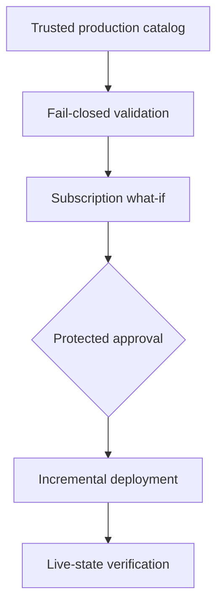

# Phase 2 implementation plan: fail-closed validation and shared Azure Container Registry

> **Historical plan (archived).** Prepared 2026-09-19 as an implementation handoff.
> Phase 2 outcomes (fail-closed validation + shared Basic ACR) are **complete on
> `main`**. Do not treat target-branch or pre-apply wording below as current status.
>
> **Authoritative status:** root [README](../../README.md),
> [operations.md](../operations.md), and [reusable-iac-design.md](../reusable-iac-design.md).
>
> Later work beyond this plan includes the Qwik foundation/release path. This
> repository still does **not** deploy `access-control-demo` (next migration).

Status at authoring time: implementation handoff  
Original target branch: `feat/iac-phase-2-shared-acr` (merged; live on `main`)  
Repository baseline at authoring: commit `e1c8fd355be98f52cb70ec4a8345d4a051144d86` (`feat/iac-first-phase-foundation`)  
Prepared: 2026-09-19

## 1. Objective

Phase 2 must deliver two outcomes:

1. Close the security and documentation gaps identified during the Phase 1 review.
2. Replace the existing shared-platform prototype with the smallest approved production platform: one shared Basic Azure Container Registry (ACR) in `rg-platform-production`.

The phase is complete only when:

- validation fails closed when caller identity or registry evidence is missing;
- the environment contract can explicitly represent workloads with or without secrets and custom domains;
- the platform Bicep creates only the platform resource group and shared ACR;
- the ACR configuration is fixed to the approved security posture;
- a reviewed Azure `what-if` precedes every apply;
- post-deployment verification proves the live registry matches the contract; and
- no application, workload identity, role assignment, Key Vault, Container App, database, image, or runtime secret is created or modified.

This is an implementation plan, not authorization to mutate Azure. The implementation agent may change repository files and run local/static validation. It must stop before the first Azure apply unless the user separately approves the exact resource group, ACR name, identity, permissions, and reviewed `what-if` output.

## 2. Non-negotiable design decisions

| Concern | Phase 2 decision |
| --- | --- |
| IaC language | Bicep |
| Azure scope | Subscription-scoped entry point creates the platform resource group, then deploys ACR at resource-group scope |
| Platform contents | One shared ACR only |
| Resource group | `rg-platform-production`, subject to explicit user approval before creation |
| Region | `australiaeast` |
| ACR SKU | `Basic` |
| ACR API | Stable `Microsoft.ContainerRegistry/registries@2025-11-01` |
| Permissions mode | `AbacRepositoryPermissions` |
| Admin account | Disabled |
| Anonymous pull | Disabled |
| Public network | Enabled for this approved Basic-tier design |
| ARM-audience authentication policy | Enabled |
| Dedicated data endpoint | Disabled |
| Customer-managed encryption | Disabled; Microsoft-managed encryption remains active |
| Task network-rule bypass | Disabled |
| Zone redundancy | Disabled |
| Registry credentials | Never requested, printed, stored, or returned |
| Authentication | Microsoft Entra OIDC only for automation; no client secrets or publish profiles |
| Deployment mode | Incremental only |
| Role assignments | None in Phase 2 |
| Image push/pull | None in Phase 2 |
| Secrets | None in Bicep, GitHub Secrets, parameters, outputs, artifacts, or logs |

### API-version correction

The earlier plan specified `2025-04-01`. Microsoft’s stable `2025-04-01` template schema does not expose `properties.roleAssignmentMode`. The stable `2025-11-01` schema does expose it and accepts `AbacRepositoryPermissions` or `LegacyRegistryPermissions`. Therefore, Phase 2 must use `2025-11-01` and must not suppress a Bicep type warning to retain the older version.

## 3. Target architecture



Azure resources after Phase 2:

```text
Azure subscription
└── rg-platform-production
    └── Microsoft.ContainerRegistry/registries/<approved-name>
```

No Log Analytics workspace, Container Apps environment, Key Vault, managed identity, role assignment, certificate, database, or application resource belongs in the platform resource group.

## 4. Required Phase 1 corrections

These corrections are prerequisites, not optional cleanup. Complete them before implementing the ACR deployment path.

### 4.1 Make caller identity validation fail closed

Files:

- `scripts/validate-contract.mjs`
- `tests/contract-validator.test.mjs`
- `package.json`
- `.github/workflows/validate.yml`

Required behavior:

1. `callerRepository`, `callerRepositoryId`, and `callerRepositoryOwnerId` are mandatory for every contract validation.
2. Missing values produce independent validation errors; they must not cause an exception or be silently skipped.
3. Each supplied value must exactly equal the trusted environment catalog value.
4. Repository and owner IDs remain strings to avoid numeric coercion.
5. CLI options must fail closed:
   - reject unknown option names;
   - reject duplicate options;
   - reject missing or empty values;
   - reject an odd number of option arguments; and
   - do not accept positional fallbacks.
6. Update CLI usage text so the three caller identity options are no longer shown as optional.
7. `npm run validate:examples` must pass all three approved fixture values.

Required unit cases:

- all three caller identity fields match: pass;
- repository name missing: fail;
- repository ID missing: fail;
- owner ID missing: fail;
- each individual mismatch: fail;
- all identity fields missing: fail with all missing-field errors;
- unknown CLI option: fail;
- duplicate CLI option: fail;
- option without a value: fail.

Do not add a development-mode bypass. Tests and examples must provide identity evidence just as the future workflow will.

### 4.2 Make image verification fail closed

Files:

- `scripts/verify-image.mjs`
- `tests/image-validator.test.mjs`

Required behavior:

1. Load the catalog through `loadAndValidateEnvironment`; never consume an unvalidated catalog.
2. Make `resolvedDigest` mandatory.
3. Fail when the registry-resolved digest is missing, malformed, or differs from the published digest.
4. Continue requiring the exact approved registry, repository, full lowercase 40-character Git SHA tag, caller SHA, and lowercase SHA-256 digest.
5. Emit the digest reference only after every check succeeds.

Required cases:

- missing resolved digest: fail;
- malformed resolved digest: fail;
- invalid environment catalog: fail;
- matching resolved digest: pass;
- existing wrong registry, repository, mutable tag, SHA mismatch, and digest mismatch tests continue to pass.

This script must not perform Azure login itself. A future authenticated workflow resolves the digest and passes the evidence to this pure validator.

### 4.3 Make optional workload capabilities explicit

Files:

- `schemas/environment.schema.json`
- `scripts/validate-environment.mjs`
- `tests/environment-validator.test.mjs`
- new positive and negative environment fixtures

Keep the catalog shape explicit while permitting applications without secrets or a custom domain:

- retain `keyVaultName`, `customDomainName`, and `certificateResourceId` as required keys;
- allow each to contain either a valid string or `null`;
- remove `minItems: 1` from `allowedSecretNames`, allowing `[]`;
- continue allowing empty `migrationSecretNames` and `externalEnvironmentVariables` arrays;
- keep `runtimeIdentityName` required because it will also be used for ACR pull, even when no Key Vault secrets exist.

Semantic rules:

- `customDomainName` and `certificateResourceId` must either both be non-null or both be null;
- validate the certificate resource prefix only when a certificate is present;
- if `allowedSecretNames` or `migrationSecretNames` is non-empty, `keyVaultName` must be non-null;
- if both secret-name arrays are empty, either a null or pre-provisioned Key Vault name is valid;
- workload contract `customDomain.enabled` must equal whether the catalog contains a non-null domain and certificate pair.

Required fixtures:

- workload with secrets and a custom domain: pass;
- workload with no secrets and no custom domain: pass;
- domain without certificate: fail;
- certificate without domain: fail;
- secrets with null Key Vault: fail.

Do not weaken `additionalProperties: false` or permit applications to provide Azure resource IDs.

### 4.4 Correct and consolidate documentation

Files:

- `docs/reusable-iac-design.md`
- `README.md`
- `docs/plans/iac-acr-reviewed-implementation-plan.md`

Required changes:

1. Fix the workload example by adding `cpu`, `memory`, `HOSTNAME`, and `PORT` so it passes the implemented production policy.
2. Use one phase numbering system everywhere. The canonical sequence is:
   - Phase 1: planning and validation foundation;
   - Phase 2: fail-closed corrections and shared ACR;
   - Phase 3: identities and workload-foundation adoption;
   - Phase 4: routine release stack and reusable workflow;
   - Phase 5: application integration;
   - Phase 6: production migration;
   - Phase 7: post-acceptance cleanup.
3. Keep durable reviewed plans under `docs/plans/` and update all links. Do not keep duplicate copies.
4. Correct the ACR API version from `2025-04-01` to `2025-11-01` wherever `roleAssignmentMode` is specified.
5. State clearly that ACR repository role assignments are Phase 3 and that Phase 2 creates no data-plane access.

## 5. Phase 2 repository changes

### 5.1 File inventory

Create:

- `environments/production.json`
- `platform/main.example.bicepparam`
- `scripts/render-platform-parameters.mjs`
- `scripts/validate-platform-what-if.mjs`
- `scripts/verify-platform.sh`
- `.github/workflows/deploy-platform.yml`
- `docs/operations.md`
- `docs/plans/phase-2-shared-acr-implementation-plan.md` if this handoff is committed
- `tests/platform-what-if-validator.test.mjs`
- safe and unsafe `what-if` fixtures
- fixtures required by Section 4.3

Update:

- `modules/container-registry/main.bicep`
- `modules/naming/main.bicep`
- `platform/main.bicep`
- `scripts/deploy-platform.sh`
- `scripts/validate-bicep.mjs`
- `schemas/environment.schema.json`
- `scripts/validate-environment.mjs`
- `scripts/validate-contract.mjs`
- `scripts/verify-image.mjs`
- existing validator tests
- `package.json`
- `.github/workflows/validate.yml`
- `README.md`
- `docs/reusable-iac-design.md`
- the reviewed master plan after moving it to `docs/plans/`

Rename:

- `platform/main.bicepparam` to `platform/main.example.bicepparam`
- `docs/plans/iac-acr-reviewed-implementation-plan.md` is the canonical master plan.

Do not modify in Phase 2:

- `modules/key-vault/`
- `modules/container-app/`
- `modules/container-apps-environment/`
- `modules/postgresql-flexible/`
- `modules/role-assignment/`
- `stacks/next-supabase/`
- `stacks/qwik-elysia-postgres/`
- application repositories

### 5.2 `modules/container-registry/main.bicep`

Reduce the module’s public API to:

- `name`;
- `location`;
- `tags`.

Remove parameters that permit callers to weaken the approved posture, including `skuName`, `adminUserEnabled`, and `publicNetworkAccess`.

The registry resource must use:

```bicep
resource registry 'Microsoft.ContainerRegistry/registries@2025-11-01' = {
  name: name
  location: location
  tags: tags
  sku: {
    name: 'Basic'
  }
  properties: {
    adminUserEnabled: false
    anonymousPullEnabled: false
    dataEndpointEnabled: false
      encryption: {
         status: 'disabled'
      }
      networkRuleBypassAllowedForTasks: false
    publicNetworkAccess: 'Enabled'
    roleAssignmentMode: 'AbacRepositoryPermissions'
    zoneRedundancy: 'Disabled'
    policies: {
      azureADAuthenticationAsArmPolicy: {
        status: 'enabled'
      }
    }
  }
}
```

Required outputs:

- `id`;
- `name`;
- `loginServer`;
- `location`;
- `skuName`;
- `roleAssignmentMode`.

Do not output credentials, tokens, admin state, or `listCredentials()` results. Do not add role assignments to this module.

### 5.3 `modules/naming/main.bicep`

Remove `acrBase` and `containerRegistryName`. ACR is globally unique, and a deterministic local naming suggestion can collide or be accidentally deployed. The exact approved registry name must come from the trusted environment catalog.

Retain the naming outputs used by workload stacks. Confirm the Bicep analyzer reports no now-unused variables.

### 5.4 `platform/main.bicep`

Replace the resource-group-scoped shared-platform prototype with a subscription-scoped entry point:

```text
targetScope = 'subscription'
parameters:
  location
  resourceGroupName
  containerRegistryName
  environment
  additionalTags
resources/modules:
  platform resource group
  ACR module scoped to that resource group
```

Use stable `Microsoft.Resources/resourceGroups@2025-04-01` for the resource group.

Required constraints:

- `environment` is limited to the existing approved values;
- ACR name uses Bicep length decorators of 5–50 characters;
- the environment schema remains responsible for the alphanumeric pattern;
- tags always include `application: platform`, the selected environment, and `managedBy: bicep`;
- `additionalTags` may add values but must not override those three mandatory tags. Construct the union in the order that makes mandatory tags authoritative;
- deploy the ACR module with `scope: platformResourceGroup`;
- no other resource modules remain in `platform/main.bicep`.

Required outputs:

- platform resource-group ID and name;
- ACR ID, name, login server, location, SKU, and role-assignment mode.

### 5.5 `environments/production.json`

Create the actual trusted production catalog only after verifying live values. Do not copy the test fixture without verification.

Requirements:

- use the real subscription ID and tenant ID;
- set location to `australiaeast`;
- set `platformResourceGroup` to the approved `rg-platform-production`;
- set the exact user-approved, globally available ACR name;
- derive `containerRegistryLoginServer` from that name;
- retain `containerRegistryRoleAssignmentMode: AbacRepositoryPermissions`;
- record the verified existing `access-control-demo` resource names and IDs;
- use `null` or empty arrays only according to Section 4.3;
- contain no secret values, tokens, credentials, connection strings, or Key Vault secret URIs.

The implementation agent must stop and ask the user for the ACR name if it has not been explicitly approved. It must not invent a production name.

### 5.6 `scripts/render-platform-parameters.mjs`

Purpose: make `environments/production.json` the sole source of production coordinates.

Behavior:

1. Accept an environment catalog path.
2. Validate it with `loadAndValidateEnvironment`.
3. Emit an ARM parameters object containing only:
   - location;
   - platform resource-group name;
   - ACR name;
   - environment name;
   - approved non-secret tags.
4. Write JSON to stdout only; diagnostics go to stderr.
5. Never accept command-line overrides for subscription, tenant, resource group, ACR name, or location.

The deployment wrapper writes this output to a runner-temporary file and removes it using `trap`.

### 5.7 `scripts/deploy-platform.sh`

Replace the current resource-group deployment wrapper with a subscription-deployment wrapper.

Interface:

```text
./scripts/deploy-platform.sh what-if environments/production.json
./scripts/deploy-platform.sh apply environments/production.json
```

Fail-closed preflight:

- accept only `what-if` or `apply`;
- require an existing environment file;
- require Node, Azure CLI, and the pinned/expected Bicep CLI;
- validate the catalog before Azure commands;
- require an authenticated account;
- compare the active subscription ID and tenant ID with the catalog and fail on either mismatch;
- require `Microsoft.ContainerRegistry` and `Microsoft.Resources` provider availability;
- check ACR-name availability when the target registry does not already exist;
- if the name is unavailable, continue only when the existing resource ID exactly equals the catalog target;
- never call `az acr credential show`, `listCredentials`, or `admin-password` commands;
- never call `az group create` imperatively;
- never use complete deployment mode.

`what-if` behavior:

- run `az deployment sub what-if` at `australiaeast`;
- use a unique, auditable deployment name;
- request machine-readable JSON;
- validate the result with `validate-platform-what-if.mjs`;
- print a human-readable summary without tokens or credentials;
- do not continue to apply.

`apply` behavior:

- require exact confirmation through `PLATFORM_APPLY_CONFIRMATION`:
  `deploy <resource-group>/<registry-name>`;
- rerun `what-if` in the same invocation;
- fail on an unsafe or unparseable result;
- run `az deployment sub create` incrementally;
- run `verify-platform.sh` immediately after deployment;
- emit only approved resource IDs, names, deployment name, and verification results.

Do not use `az account set` to hide a caller’s incorrect context. The caller must authenticate to the catalog’s subscription deliberately.

### 5.8 `scripts/validate-platform-what-if.mjs`

The validator must parse JSON, not scrape colored console output.

Allow only these resource IDs:

1. `/subscriptions/<approved-subscription>/resourceGroups/rg-platform-production`
2. that resource group’s one approved ACR resource ID

Rules:

- reject deletion of any resource;
- reject creation or modification outside the two approved IDs;
- reject any additional resource type;
- reject an unrecognized change type;
- reject a diagnostic or error indicating an incomplete expansion;
- for the first deployment, accept creation of the resource group and ACR only;
- for subsequent deployments, accept `NoChange` and a reviewed `Modify` only for those resources;
- require explicit human approval for any `Modify` result;
- produce a concise normalized summary suitable for the GitHub step summary.

Test with fixtures representing:

- safe first creation;
- safe idempotent run;
- allowed-resource modification;
- registry deletion;
- unrelated resource creation;
- wrong resource group;
- malformed JSON;
- unsupported or incomplete result.

### 5.9 `scripts/verify-platform.sh`

After deployment, query live Azure state and compare it with the validated catalog.

Verify:

- exact subscription, tenant, resource group, registry name, registry ID, login server, and region;
- `sku.name == Basic`;
- `adminUserEnabled == false`;
- `anonymousPullEnabled == false`;
- `dataEndpointEnabled == false`;
- `encryption.status == disabled`;
- `networkRuleBypassAllowedForTasks == false`;
- `publicNetworkAccess == Enabled`;
- `roleAssignmentMode == AbacRepositoryPermissions`;
- `zoneRedundancy == Disabled`;
- `policies.azureADAuthenticationAsArmPolicy.status == enabled`;
- mandatory tags exist with exact values;
- the platform resource group contains no resource other than the approved registry;
- no Phase 2 role assignments were created by the deployment.

Fail on missing/null properties rather than treating them as defaults. Never display credentials.

### 5.10 `.github/workflows/deploy-platform.yml`

This workflow is manual and privileged. It must not run on `push` or `pull_request`.

Trigger inputs:

- environment: allow only `production` in Phase 2;
- operation: `what-if` or `apply`;
- confirmation: required for `apply` and must match the exact target phrase.

Jobs:

1. **static-validation**
   - checkout;
   - Node 22;
   - `npm ci --ignore-scripts`;
   - run the complete static validation suite;
   - no Azure login.
2. **azure-preflight-and-what-if**
   - `id-token: write`, `contents: read` only;
   - authenticate using the dedicated platform OIDC identity;
   - validate active tenant and subscription;
   - run the wrapper in `what-if` mode;
   - publish the normalized result and immutable commit SHA to the job summary.
3. **platform-deploy**
   - run only for `apply` and exact confirmation;
   - use GitHub environment `platform-production` so approval occurs after the first `what-if`;
   - use `concurrency: platform-production` with `cancel-in-progress: false`;
   - authenticate independently using OIDC;
   - rerun validated `what-if` immediately before deployment;
   - apply incrementally.
4. **post-deploy-verification**
   - run live-state verification;
   - fail the workflow if any property differs.
5. **summary**
   - run with `always()`;
   - fail unless every required preceding job succeeded or was correctly skipped for a what-if-only request;
   - record commit SHA, deployment name, target subscription ID, resource group, ACR ID, and verification status.

Workflow requirements:

- all actions pinned to full commit SHAs with version comments;
- no `secrets: inherit`;
- Azure client, tenant, and subscription identifiers stored as protected environment variables, not credentials;
- no service-principal password, client secret, publish profile, registry password, or Azure credential JSON;
- no fallback authentication method;
- no broad application identity reused as the platform identity;
- no application repository can call this workflow;
- no role-assignment creation.

OIDC prerequisite:

- A dedicated platform identity and federated credential must already exist and be approved by the user/operator.
- The trust must bind this repository and the `platform-production` GitHub environment.
- The identity needs control-plane permissions sufficient for the approved subscription deployment but no ACR data-plane role and no role-assignment permission.
- If the identity, subject, scope, or role cannot be verified, the workflow must stop. Do not replace OIDC with a client secret.

Approved implementation clarification: the pre-approval job uses a separate what-if-only planner identity selected by `PLATFORM_PLAN_CLIENT_ID`. The protected `platform-production` job uses `PLATFORM_DEPLOY_CLIENT_ID`. Tenant and subscription identifiers are shared non-secret variables. This preserves what-if-before-approval without exposing deploy authority to the planning job.

The initial creation may instead be executed manually by an authenticated trusted operator using the same script. The repository must not pretend to automate bootstrap authority it does not possess.

### 5.11 `platform/main.example.bicepparam`

Keep this file as documentation and compilation support only. Clearly label all values as examples. Production deployment must use parameters rendered from the validated environment catalog, not this file.

### 5.12 `docs/operations.md`

Document:

- local prerequisites and exact supported versions;
- how to validate without Azure login;
- how to authenticate deliberately to the correct tenant and subscription;
- how to run platform `what-if`;
- how to interpret safe and unsafe changes;
- the separate user approval required before apply;
- how to run apply and verification;
- how to inspect deployment history;
- expected idempotent behavior;
- failure recovery;
- why there are no ACR role assignments yet;
- that deleting the resource group or registry is not a Phase 2 operation;
- that ACR credentials must never be requested.

## 6. Test and validation requirements

### 6.1 Local/static checks

All must pass:

```bash
npm ci --ignore-scripts
npm test
npm run validate:environment
npm run validate:examples
npm run validate:bicep
bash -n scripts/*.sh
shellcheck scripts/*.sh
git diff --check
```

Compile all Bicep files using the pinned Bicep CLI and reject warnings as failures.

### 6.2 Compiled-template assertions

Add a validation step that compiles `platform/main.bicep` and asserts that the generated ARM template contains:

- one resource-group resource;
- one nested ACR deployment/resource;
- ACR API `2025-11-01`;
- Basic SKU;
- every locked property from Section 2;
- no Key Vault, Log Analytics, Container Apps, PostgreSQL, managed identity, or role-assignment resource types;
- no `listCredentials` expression;
- no secure value or secret output.

These assertions must fail if a future change makes a security property configurable.

### 6.3 Security scan

Compile Bicep to ARM before Checkov. Review current suppressions after the platform prototype is removed.

- Keep only exclusions genuinely required by the approved public Basic ACR design.
- Remove exclusions that existed solely because the old platform created a legacy Key Vault.
- Every remaining exclusion must identify the exact resource, reason, approving design decision, and review phase.
- Never add a repository-wide suppression merely to make CI green.

### 6.4 Azure checks before mutation

The first Azure apply is blocked until all are true:

- the user approved the exact globally unique ACR name;
- `az acr check-name` confirms availability, or the exact intended registry already exists;
- the user approved creation of `rg-platform-production`;
- subscription and tenant match the catalog;
- required resource providers are available;
- the platform OIDC identity or trusted human operator is identified;
- effective permissions are reviewed;
- the subscription-scope `what-if` is saved and reviewed;
- the result contains only the approved resource group and ACR;
- no deletion or replacement is present;
- CI is green.

## 7. Deployment and verification sequence

1. Merge the Phase 1 corrections only after their tests pass.
2. Implement the subscription platform entry point and strict ACR module.
3. Populate the production catalog from verified values.
4. Run all static checks without Azure login.
5. Authenticate to the exact production tenant and subscription.
6. Run name-availability and provider preflight.
7. Run subscription `what-if`.
8. Stop and present the normalized output to the user.
9. Obtain explicit approval for the exact changes.
10. Rerun `what-if` immediately before deployment.
11. Deploy incrementally.
12. Run live-state verification.
13. Run a second `what-if`; it should report no material change.
14. Record deployment name, source commit, resource IDs, and verification result.

Never combine Steps 7–11 into an unreviewed automatic path.

## 8. Rollback and recovery

Phase 2 creates a new, empty registry, so no application rollback is required.

If deployment fails before registry creation:

- preserve the deployment operation output;
- fix the repository code or catalog;
- rerun static validation and `what-if`;
- do not apply manual portal changes to make the template pass.

If the registry exists but verification fails:

- do not delete it automatically;
- inspect live state and deployment operations;
- correct only through reviewed Bicep when safe;
- stop if remediation proposes deletion, replacement, a different name, a different region, or broader network/authentication access.

Deletion is deliberately excluded from Phase 2. A separate guarded teardown plan is required even if the registry is empty.

## 9. Stop conditions

The implementation agent must stop and ask for direction if:

- the approved ACR name is missing, unavailable, or differs between files;
- the target subscription, tenant, region, or resource group is uncertain;
- the active Azure context differs from the catalog;
- the ACR API schema does not compile with `roleAssignmentMode`;
- satisfying Checkov requires weakening the locked design or adding a broad suppression;
- a client secret, registry credential, publish profile, or long-lived credential appears necessary;
- the workflow identity requires role-assignment permissions or ACR data-plane permissions;
- `what-if` contains deletion, replacement, an unrelated resource, an unknown change, or incomplete expansion;
- an existing resource occupies the approved ACR name at a different resource ID;
- any secret value appears in repository files, parameters, logs, outputs, or artifacts;
- a change to an application stack or live workload appears necessary;
- the user has not explicitly approved Azure mutation.

## 10. Acceptance criteria

### Repository

- Phase 1 caller identity validation fails closed.
- Image verification fails when resolved registry evidence is absent.
- Optional capability fixtures behave as specified.
- Documentation examples pass validation.
- Phase numbering is consistent.
- Durable plans live under `docs/plans/`, not `agent-tmp-plans/`.
- All Bicep and shell validation is clean.
- All actions are SHA-pinned.

### Compiled platform

- The subscription template creates exactly one resource group and one ACR.
- ACR uses stable API `2025-11-01`.
- Security properties are hard-coded, not caller-configurable.
- No credentials or secret outputs exist.
- No role assignments exist.

### Workflow

- Static validation requires no Azure authentication.
- Platform deployment is manual, protected, and serialized.
- Authentication is OIDC-only.
- Tenant and subscription mismatches fail before `what-if` or deployment.
- Apply requires exact confirmation, protected approval, and a fresh safe `what-if`.
- Deployment is incremental.

### Live Azure state

- `rg-platform-production` exists at the approved location.
- It contains exactly the approved Basic ACR.
- Admin user and anonymous pull are disabled.
- Public network access is enabled as approved.
- ABAC repository permissions mode is enabled.
- ARM-audience authentication policy is enabled.
- Dedicated data endpoint and zone redundancy are disabled.
- Customer-managed encryption and task network-rule bypass are disabled.
- No data-plane or role-assignment access has been granted.
- A second `what-if` is materially empty.

## 11. Recommended commit structure

1. `fix: make infrastructure validation fail closed`
   - caller identity, image evidence, optional capabilities, tests.
2. `docs: align implementation phases and examples`
   - documentation corrections and plan move.
3. `feat: define subscription-scoped shared ACR platform`
   - ACR module, naming cleanup, platform entry point, catalog, parameter renderer.
4. `feat: add guarded platform what-if and deployment workflow`
   - scripts, workflow, operations documentation, tests.

Do not mix the first Azure apply into a source-control commit. Azure mutation is an operational action after review.

## 12. Instructions to the implementation agent

1. Read this entire plan and the current repository before editing.
2. Preserve unrelated user changes.
3. Implement in the order specified; do not begin ACR work before fail-closed tests pass.
4. Show every repository change in the editor/diff for review.
5. Run and report every applicable validation command.
6. Do not suppress warnings, skip failing tests, weaken security properties, or introduce alternative authentication.
7. Do not mutate Azure without separate explicit user approval after presenting the exact `what-if`.
8. If any implementation detail conflicts with the current Azure schema or live inventory, stop and report the conflict with evidence.

## 13. Authoritative sources

Only primary Microsoft documentation was used for Azure-specific decisions.

| Source | Use | Trust rating |
| --- | --- | ---: |
| [Microsoft.ContainerRegistry registries 2025-11-01 template reference](https://learn.microsoft.com/en-us/azure/templates/microsoft.containerregistry/2025-11-01/registries) | Stable ACR schema, accepted properties and enum values | 0.99 |
| [Azure ABAC repository permissions](https://learn.microsoft.com/en-us/azure/container-registry/container-registry-rbac-abac-repository-permissions) | ABAC mode and repository-scoped role behavior | 0.99 |
| [ACR Microsoft Entra permissions and built-in roles](https://learn.microsoft.com/en-us/azure/container-registry/container-registry-rbac-built-in-roles-overview) | Separation of control-plane and data-plane permissions | 0.99 |
| [Microsoft.Resources resourceGroups template reference](https://learn.microsoft.com/en-us/azure/templates/microsoft.resources/resourcegroups) | Subscription-scoped resource-group deployment | 0.99 |
| [ARM template deployment what-if](https://learn.microsoft.com/en-us/azure/azure-resource-manager/templates/deploy-what-if) | Pre-deployment change review | 0.99 |
| [Authenticate to Azure from GitHub Actions using OIDC](https://learn.microsoft.com/en-us/azure/developer/github/connect-from-azure-openid-connect) | Secretless GitHub-to-Azure authentication | 0.99 |

No source below the requested 0.95 confidence threshold influenced this plan.
