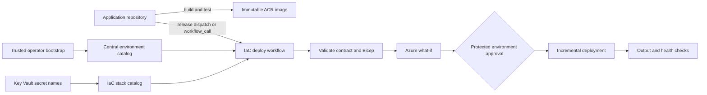

# Reusable Azure IaC design

Status: approved architecture; shared ACR live; Qwik production path implemented;
`access-control-demo` catalogued but **not yet migrated or deployed from this
repository** (next).

Last documentation pass: 2026-09-24.

Historical phase plans live under [plans/](plans/) and must not be read as live
status. Prefer this document and the root [README](../README.md).

## Goal

Make this repository the owner of Azure infrastructure definitions and
deployment mechanics while application repositories continue to own application
code, tests, images, database migrations, and workload-specific configuration.

Proof points:

1. **Done (greenfield):** onboard `qwik-website` without copying Azure deployment
   logic into that repository. Source builds and publishes an image; this
   repository plans, applies, and verifies the Container App.
2. **Next (brownfield):** migrate `access-control-demo` without losing behavior
   from its current production workflow (Key Vault refs, custom domain,
   hosted Supabase migration, health checks, protected environments).

This repository does **not** currently deploy `access-control-demo`. The
workload appears in `environments/production.json` so contracts and fixtures can
target it, but foundation Bicep, release stack, and deploy workflow for that app
are still future work.

## Current baseline (code and ops)

Implemented and in active use:

| Capability | Location |
| --- | --- |
| Strict environment + workload JSON Schemas | `schemas/` |
| Semantic validators (identity, bounds, secrets, domains, images) | `scripts/validate-*.mjs`, `scripts/verify-*.mjs` |
| Fixture coverage for unsafe contracts and what-if results | `tests/` |
| Seven-job static validation workflow | `.github/workflows/validate.yml` |
| Shared Basic ACR platform (subscription entry point) | `platform/`, `modules/container-registry/` |
| Guarded platform what-if / apply / verify | `scripts/deploy-platform.sh`, `deploy-platform.yml`, [operations.md](operations.md) |
| Single-container workload foundation (RG, ACA env, UAMIs, ACR ABAC) | `foundations/single-container-web/` |
| Production release stack with sticky custom domains + UAMI pull | `stacks/single-container-web/`, `modules/container-app/` |
| Qwik release-driven deploy (dispatch → plan → apply → HTTP verify) | `deploy-qwik-release.yml`, `scripts/deploy-workload-release.sh` |
| Trusted production catalog | `environments/production.json` |
| Committed Qwik workload contract | `workloads/qwik-website/production.json` |

Prototype-only (not production paths):

- `stacks/next-supabase/` — early Next.js + hosted Supabase shape
- `stacks/qwik-elysia-postgres/` — multi-app + PostgreSQL shape; production selection rejected by validators
- `scripts/deploy-stack.sh` / `scripts/bootstrap-oidc.sh` — local/legacy helpers

Known prototype debt retained until brownfield migration:

- `next-supabase` still accepts publishable key material as a deployment parameter and emits `NEXT_PUBLIC_SUPABASE_*` names. Production `access-control-demo` uses `NEXT_SUPABASE_*` and Key Vault-backed secrets; the migrated stack must not copy the prototype secret path.
- Legacy `modules/key-vault` defaults are not the production posture for adoption; brownfield must match the live vault (`RBAC`, purge protection enabled).
- Generic `modules/container-apps-environment` uses direct Log Analytics configuration; live `access-control-demo` uses `azure-monitor` + diagnostic settings and must be modeled exactly before adoption.

## Ownership boundary

| Concern | Application repository | IaC repository | Azure / operator |
| --- | --- | --- | --- |
| Source, tests, Dockerfile | Owns | Does not own | N/A |
| Image build and immutable tag | Owns | Consumes image reference | ACR stores image |
| App database migrations | Owns | Does not run them (except a future dedicated hosted-migration job for access-control) | Target database applies them |
| Non-secret runtime settings | Declares in workload contract | Validates and deploys | Container App receives them |
| Runtime secret values | Never commits them | Declares references only | Operator writes values to Key Vault |
| Azure resource definitions | Does not copy them | Owns modules, foundations, stacks | ARM deploys them |
| Azure target coordinates | Selects an environment name | Resolves subscription/RG/platform from catalog | Central environment configuration owns them |
| OIDC and RBAC | Requests a known environment | Owns foundation templates and bootstrap guidance | Trusted operator approves privileged changes |
| Production approval | Qwik: protected envs in IaC repo via dispatch; future `workflow_call`: caller-owned env | Defines the deploy jobs | Reviewer approves on the owning repository |

This boundary matters because accepting an arbitrary subscription ID, resource
group, Bicep path, or Azure resource ID from an application repository would let
that repository redirect a trusted deployment identity. Application input must
be schema-validated and constrained to a known stack and environment.

## Recommended architecture



Keep distinct security lanes:

1. **Foundation operator**: creates ACR assignments, identities, OIDC credentials, and privileged role assignments. Version 1 uses a trusted operator rather than routine automation for foundation apply.
2. **Publisher identity**: writes only the workload's ACR repository (and, for access-control later, reads only the two hosted-migration secrets).
3. **Planner identity**: reads approved resources and runs validation and `what-if`, but cannot deploy.
4. **Deployer identity**: updates only the Container App release surface and cannot create role assignments, identities, vault values, certificates, environments, or diagnostic settings.
5. **Runtime identity**: pulls only the workload's ACR repository and resolves approved Key Vault references when secrets exist.

Resource groups:

```text
rg-platform-production          shared Basic ACR
rg-qwik-website-production      Qwik foundation + app (managed here)
rg-access-control-demo          existing app RG (adopt in place next; do not rename/move)
```

The shared ACR uses ABAC repository permissions. Cross-resource-group ACR
assignments belong to the foundation lane, never the routine deployment stack.

## Repository shape (actual)

```text
.github/workflows/
  validate.yml
  deploy-platform.yml
  deploy-qwik-release.yml
docs/
  reusable-iac-design.md
  operations.md
  workloads/qwik-website-runbook.md
  plans/                         historical only
environments/
  production.json
foundations/
  single-container-web/
modules/
  container-app/
  container-apps-environment/
  container-registry/
  key-vault/                     legacy / future brownfield
  log-analytics/
  managed-identity/
  naming/
  postgresql-flexible/           prototype only
  role-assignment/
  tags/
platform/
schemas/
  environment.schema.json
  workload.schema.json
scripts/
  bootstrap-oidc.sh
  deploy-platform.sh
  deploy-stack.sh
  deploy-workload-release.sh
  render-platform-parameters.mjs
  render-workload-parameters.mjs
  resolve-acr-image.sh
  validate-bicep.mjs
  validate-contract.mjs
  validate-environment.mjs
  validate-platform-what-if.mjs
  validate-workload-what-if.mjs
  verify-image.mjs
  verify-platform.sh
  verify-release.mjs
stacks/
  single-container-web/          production path
  next-supabase/                 prototype
  qwik-elysia-postgres/          prototype
tests/
  fixtures/
workloads/
  qwik-website/production.json
```

Not present yet (planned for `access-control-demo` migration and generalization):

- `foundations/access-control-demo/` or equivalent brownfield foundation
- `stacks/access-control-demo/`
- `.github/workflows/deploy-workload.yml` (generic `workflow_call`)
- `.github/workflows/teardown-workload.yml`
- `scripts/bootstrap-platform.sh` / `scripts/bootstrap-workload.sh` as named in early plans (foundation apply is operator-driven from Bicep today)

Do not turn every Azure option into a workload input. Add a stack when a
workload has a meaningfully different topology; add a module when several stacks
need the same resource.

## Workload contract

Each application should expose a non-secret contract. Qwik's committed example:

```json
{
  "$schema": "../../schemas/workload.schema.json",
  "schemaVersion": 1,
  "application": "qwik-website",
  "stack": "single-container-web",
  "environment": "production",
  "container": {
    "targetPort": 3000,
    "healthProbePath": "/health",
    "cpu": "0.25",
    "memory": "0.5Gi",
    "minReplicas": 1,
    "maxReplicas": 1
  },
  "env": {
    "NODE_ENV": "production",
    "PORT": "3000",
    "HOST": "0.0.0.0"
  },
  "secretRefs": {},
  "customDomain": {
    "enabled": true
  }
}
```

Illustrative future `access-control-demo` contract shape (not deployed from this
repo yet):

```json
{
  "$schema": "https://example.invalid/iac/schemas/workload.schema.json",
  "schemaVersion": 1,
  "application": "access-control-demo",
  "stack": "access-control-demo",
  "environment": "production",
  "container": {
    "targetPort": 3000,
    "healthProbePath": "/api/health",
    "cpu": "0.25",
    "memory": "0.5Gi",
    "minReplicas": 1,
    "maxReplicas": 1
  },
  "env": {
    "NODE_ENV": "production",
    "NEXT_TELEMETRY_DISABLED": "1",
    "HOSTNAME": "0.0.0.0",
    "PORT": "3000",
    "ACCESS_GATE_DISABLED": "false"
  },
  "secretRefs": {
    "ACCESS_GATE_CODE_SECRET": "access-gate-code-secret",
    "ACCESS_GATE_COOKIE_SECRET": "access-gate-cookie-secret"
  },
  "customDomain": {
    "enabled": true
  }
}
```

The contract deliberately excludes subscription IDs, tenant IDs, resource group
IDs, identity IDs, certificate resource IDs, custom-domain hostnames, Key Vault
URLs, image coordinates, and secret values. The deploy path resolves Azure
targets from `environments/<name>.json`. Image tag and digest come from the
build/release pipeline and are validated separately.

Validate against JSON Schema before Azure login. Also enforce semantic rules:
known stack, known environment, allow-listed env names, immutable image digest
or SHA tag, valid ports, bounded replicas, secret names approved for the
workload, and `customDomain.enabled` aligned with catalog domain/certificate
pairs.

## Deploy workflow patterns

### Current: IaC-owned release dispatch (Qwik)

```text
qwik-website release.yml
  → build/test/push ACR image
  → repository_dispatch qwik-website-release-v1
      → iac deploy-qwik-release.yml
          → verify release + contract
          → planner what-if
          → protected production apply
          → HTTP health verify
```

Production approval for this pattern lives on IaC GitHub environments
(`production-plan`, `production`) because the deploy workflow runs in this
repository. See [workloads/qwik-website-runbook.md](workloads/qwik-website-runbook.md).

### Future: caller-owned reusable workflow (likely access-control)

```yaml
jobs:
  deploy:
    needs: build
    permissions:
      contents: read
      id-token: write
    uses: your-org/iac/.github/workflows/deploy-workload.yml@<full-sha>
    with:
      environment: production
      contract-path: .azure/workload.production.json
      caller-sha: ${{ github.sha }}
      image-tag: ${{ needs.publish.outputs.image_tag }}
      image-digest: ${{ needs.publish.outputs.image_digest }}
```

Pin to a full commit SHA. Do not use `secrets: inherit`. Runtime and migration
values are not stored in GitHub Secrets. OIDC identifiers and approved non-secret
application values are configuration variables.

For `workflow_call`, production approval belongs to the **calling** application
repository because reusable-workflow jobs execute in the caller context.

OIDC trusts should use immutable repository identity in the subject where the
GitHub token emits it (verified for these repos as
`repo:Owner@ownerId/name@repoId:environment:...`).

## Bicep module status

| Need | Status |
| --- | --- |
| Custom domain + managed certificate inputs | Done (`modules/container-app`) |
| Additional sticky custom domains | Done |
| User-assigned identity on Container App | Done |
| Registry pull via UAMI | Done |
| `AZURE_CUSTOM_DOMAIN` primary hostname injection | Done on single-container-web path |
| Key Vault secret references (no raw secret values) | **Remaining** for access-control parity |
| Brownfield ACA env with `azure-monitor` + diagnostics | **Remaining** |
| Access-control foundation + stack | **Remaining** |
| Generic reusable deploy + teardown workflows | **Remaining** |

Proposed Key Vault reference shape for the migration:

```bicep
@description('Key Vault-backed Container App secrets.')
param keyVaultSecretRefs array = []

// Each item contains name, keyVaultUrl, and identityResourceId.
var secretDefinitions = [
  for secret in keyVaultSecretRefs: {
    name: secret.name
    keyVaultUrl: secret.keyVaultUrl
    identity: secret.identityResourceId
  }
]
```

The stack maps approved contract secret names to vault URIs; the application
repository never supplies the URI or value.

## Validation and release gates

Every pull request in this repository runs the seven-job workflow equivalent of:

```bash
npm ci --ignore-scripts
npm test
npm run validate:environment
npm run validate:examples
npm run validate:bicep
bash -n scripts/*.sh
# CI also: ShellCheck 0.11.0, Checkov 3.3.19 on compiled ARM
```

Bicep entry points compiled by `scripts/validate-bicep.mjs`:

- `platform/main.bicep`
- `foundations/single-container-web/main.bicep`
- `stacks/single-container-web/main.bicep`
- `stacks/next-supabase/main.bicep`
- `stacks/qwik-elysia-postgres/main.bicep`

Deployment gates:

1. Validate the contract before login.
2. Authenticate with OIDC.
3. Run `what-if` and publish the result.
4. Require protected environment approval for production apply.
5. Deploy in incremental mode with a unique deployment name.
6. Verify required outputs and poll the health endpoint.
7. Record IaC version, caller commit, image digest, deployment name, and URL.

Checkov scans compiled ARM because direct Bicep parsing misses several modules.
Temporary exceptions for Basic ACR features and the legacy Key Vault module are
listed explicitly in `validate.yml`. Any remaining exception must state the
approved architectural reason.

Teardown remains a separate manual process. It is not automated in this
repository yet.

## Delivery plan

| Phase | Deliverable | Status |
| --- | --- | --- |
| 1 | Planning and validation foundation | **Done** |
| 2 | Fail-closed corrections and shared ACR | **Done** |
| 3a | Qwik foundation, identities, ABAC, release stack | **Done** |
| 3b | Qwik sticky custom domains + release hardening | **Done** |
| 4 | `access-control-demo` brownfield foundation + Key Vault refs | **Next** |
| 5 | `access-control-demo` routine deploy + hosted migration job | Planned |
| 6 | Parity, soak, remove obsolete app-repo Azure paths | Planned |
| 7 | Optional generic `workflow_call` + teardown workflows | Planned |

## Tracking checklist

### Done

- [x] Shared Basic ACR in `rg-platform-production` with ABAC mode and ARM-audience auth
- [x] Fail-closed schemas, semantic validators, and safe/unsafe fixtures
- [x] Separately visible static validation workflow
- [x] Platform guarded what-if / apply / verify
- [x] Qwik foundation (RG, ACA env, UAMIs, ACR repository roles)
- [x] Qwik release stack with digest deploy and HTTP verification
- [x] Custom domain and certificate support (primary + additional sticky bindings)
- [x] User-assigned identity support on Container App + registry pull
- [x] Catalog entries for both `qwik-website` and `access-control-demo`

### Next / remaining

- [ ] **Migrate `access-control-demo` into this repository** (does not deploy it today)
- [ ] Capture live `access-control-demo` resource IDs and outputs as adoption fixtures
- [ ] Brownfield foundation that preserves `azure-monitor` diagnostics and existing names
- [ ] Key Vault reference support (no raw secret parameters on the production path)
- [ ] Hosted Supabase migration job with just-in-time secret fetch
- [ ] Correct production Supabase env names (`NEXT_SUPABASE_*`)
- [ ] ACR repository role assignments scoped to `access-control-demo`
- [ ] Parity smoke checks and soak before removing the old app-repo deploy path
- [ ] Optional generic reusable deploy/teardown workflows
- [ ] Tag a stable workflow and pin callers when generalization lands

## Remaining deployment gates before access-control migration

1. Inventory live `access-control-demo` resources and confirm adopt-in-place names.
2. Design foundation what-if that does not replace environment, vault, domain, or diagnostics.
3. Create planner/publisher/deployer identities and OIDC subjects for that workload.
4. Implement Key Vault references and contract wiring.
5. Review exact workload `what-if` before any apply.
6. Keep the existing application deploy path until ACR-backed parity passes.

No live `access-control-demo` resource should be changed by this repository until
those gates are approved.
