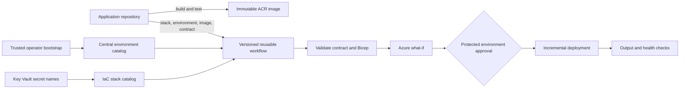

# Reusable Azure IaC design

Status: approved architecture; Phase 2 shared ACR deployed and verified

The detailed implementation order, permission model, migration gates, and acceptance criteria are in [plans/iac-acr-reviewed-implementation-plan.md](plans/iac-acr-reviewed-implementation-plan.md). The Phase 2 handoff is in [plans/phase-2-shared-acr-implementation-plan.md](plans/phase-2-shared-acr-implementation-plan.md). This document summarizes the durable design.

## Goal

Make this repository the owner of Azure infrastructure definitions and deployment mechanics while application repositories continue to own application code, tests, images, database migrations, and workload-specific configuration.

The first proof is migrating `access-control-demo` without losing any behavior from its current production workflow. The second proof is onboarding `qwik-website` or `fullstack-architecture-demo` without copying Azure deployment logic into that repository.

## Current baseline

The repository already has a useful foundation:

- `modules/` contains reusable Bicep resources.
- `platform/` contains the subscription-scoped shared ACR platform.
- `stacks/` contains opinionated application shapes rather than one universal template.
- `scripts/bootstrap-oidc.sh` creates a GitHub OIDC trust and a resource-group-scoped deployment identity.
- All current Bicep entry points compile with Bicep CLI 0.47.16, and all shell scripts pass `bash -n` and ShellCheck 0.11.0.

The operational reference in `access-control-demo` adds behavior that this repository does not yet preserve:

- GitHub environment approvals and deployment concurrency.
- Release-tag validation, application tests, image tests, and immutable SHA image tags.
- Key Vault references through a user-assigned managed identity.
- Custom domain and certificate binding.
- Deployment output checks and post-deployment health verification.
- A guarded teardown workflow.

The current reusable prototype also has several gaps to close before it should deploy production workloads:

- There is no reusable workload deployment workflow yet. Phase 2 adds the guarded manual platform workflow.
- Platform outputs must be copied manually into stack parameter files.
- Secret values are accepted as deployment parameters and stored as Container App secrets instead of using Key Vault references.
- Key Vault defaults to public access with purge protection disabled.
- PostgreSQL defaults to public access and allows all Azure services.
- Application stacks create `AcrPull` role assignments, but the bootstrap grants the deployment identity only `Contributor`; that role cannot normally create role assignments.
- Shared platform and application resources can be placed in one resource group, which makes least-privilege deployment boundaries difficult.

## Ownership boundary

| Concern | Application repository | IaC repository | Azure / operator |
| --- | --- | --- | --- |
| Source, tests, Dockerfile | Owns | Does not own | N/A |
| Image build and immutable tag | Owns | Consumes image reference | ACR stores image |
| App database migrations | Owns | Does not run them | Target database applies them |
| Non-secret runtime settings | Declares in workload contract | Validates and deploys | Container App receives them |
| Runtime secret values | Never commits them | Declares references only | Operator writes values to Key Vault |
| Azure resource definitions | Does not copy them | Owns modules and stacks | ARM deploys them |
| Azure target coordinates | Selects an environment name | Resolves subscription/RG/platform | Central environment configuration owns them |
| OIDC and RBAC | Requests a known environment | Owns bootstrap automation | Trusted operator approves privileged changes |
| Production approval | Owns the protected environment and calls a pinned workflow | Defines the reusable jobs | Reviewer approves in the application repository |

This boundary matters because accepting an arbitrary subscription ID, resource group, Bicep path, or Azure resource ID from an application repository would let that repository redirect a trusted deployment identity. Application input must be schema-validated and constrained to a known stack and environment.

## Recommended architecture



Keep distinct security lanes:

1. **Foundation operator**: creates ACR, identities, OIDC credentials, custom roles, and role assignments. Version 1 uses a trusted operator rather than routine automation.
2. **Publisher/migration identity**: writes only the workload's ACR repository and reads only the two hosted-migration secrets.
3. **Planner identity**: reads approved resources and runs validation and `what-if`, but cannot deploy.
4. **Deployer identity**: updates only the Container App release surface and cannot create role assignments, identities, vault values, certificates, environments, or diagnostic settings.
5. **Runtime identity**: pulls only the workload's ACR repository and resolves approved Key Vault references.

Version 1 adopts the current workload resource group instead of renaming or moving production resources:

```text
rg-platform-production       new shared Basic ACR
rg-access-control-demo       adopted application resources and stable dependencies
```

The shared ACR uses ABAC repository permissions. Cross-resource-group ACR assignments and Key Vault assignments belong to the foundation lane, never the routine deployment stack.

## Repository shape

```text
.github/workflows/
  validate.yml                 validate every change
  deploy-platform.yml          protected, privileged workflow
  deploy-workload.yml          reusable workflow_call entry point
  teardown-workload.yml        guarded manual teardown
docs/
  reusable-iac-design.md
environments/
  production.json
modules/
  ...                          low-level resource modules
stacks/
  access-control-demo/         first production-supported adoption stack
  next-supabase/               existing prototype
  qwik-elysia-postgres/        existing opinionated shape
scripts/
  bootstrap-platform.sh
  bootstrap-workload.sh
  validate-contract.mjs
  validate-environment.mjs
  verify-image.mjs
  deploy-platform.sh
  deploy-stack.sh
schemas/
  environment.schema.json
  workload.schema.json
tests/
  fixtures/                    valid and unsafe validation cases
```

Do not turn every Azure option into a workload input. Add a stack when a workload has a meaningfully different topology; add a module when several stacks need the same resource. This keeps security defaults enforceable.

## Workload contract

Each application repository should commit a non-secret file such as `.azure/workload.production.json`:

```json
{
  "$schema": "https://example.invalid/iac/schemas/workload.schema.json",
  "schemaVersion": 1,
  "application": "access-control-demo",
  "stack": "access-control-demo",
  "environment": "production",
  "container": {
    "targetPort": 3000,
    "healthProbePath": "/api/health",
    "cpu": "0.25",
    "memory": "0.5Gi",
    "minReplicas": 1,
    "maxReplicas": 1
  },
  "env": {
    "NODE_ENV": "production",
    "NEXT_TELEMETRY_DISABLED": "1",
    "HOSTNAME": "0.0.0.0",
    "PORT": "3000",
    "ACCESS_GATE_DISABLED": "false"
  },
  "secretRefs": {
    "ACCESS_GATE_CODE_SECRET": "access-gate-code-secret",
    "ACCESS_GATE_COOKIE_SECRET": "access-gate-cookie-secret"
  },
  "customDomain": {
    "enabled": true
  }
}
```

The contract deliberately excludes subscription IDs, tenant IDs, resource group IDs, identity IDs, certificate resource IDs, custom-domain hostnames, Key Vault URLs, image coordinates, and secret values. The reusable workflow resolves Azure targets from `environments/<name>.json`. Non-secret Supabase runtime values come from approved GitHub environment variables whose names are allow-listed by the catalog. The image tag and digest are supplied by the build pipeline and validated separately.

Validate this file against JSON Schema before Azure login. Also enforce semantic rules in a script: known stack, known environment, allowed environment-variable names, immutable image digest or SHA tag, valid ports, bounded replicas, and secret names that are approved for the selected workload.

## Reusable workflow contract

An application repository should contain only a thin caller after its build job:

```yaml
jobs:
  deploy:
    needs: build
    permissions:
      contents: read
      id-token: write
    uses: your-org/iac/.github/workflows/deploy-workload.yml@v1
    with:
      environment: production
      contract-path: .azure/workload.production.json
      caller-sha: ${{ github.sha }}
      image-tag: ${{ needs.publish.outputs.image_tag }}
      image-digest: ${{ needs.publish.outputs.image_digest }}
```

Pin the reusable workflow to a full commit SHA. The called workflow checks out both the caller and its own source at immutable SHAs, validates inputs, runs `what-if`, deploys through a separate narrowly scoped identity, verifies outputs, and returns the application URL.

Production approval belongs to the calling application repository because reusable-workflow jobs execute in the caller context. Do not use `secrets: inherit`. Runtime values and hosted-migration values are not stored in GitHub Secrets. OIDC identifiers and approved non-secret application values are configuration variables.

OIDC removes long-lived Azure credentials. Create separate federated credentials for publisher, planner, and deployer jobs. Customize the subject to include immutable repository identity, environment context, and `job_workflow_ref`, then bind it to the exact reusable workflow SHA.

## Bicep evolution

Keep the current `modules/container-app/main.bicep` API for plain values, but replace raw secret values with Key Vault references. A proposed module input is:

```bicep
@description('Key Vault-backed Container App secrets.')
param keyVaultSecretRefs array = []

// Each item contains name, keyVaultUrl, and identityResourceId.
var secretDefinitions = [
  for secret in keyVaultSecretRefs: {
    name: secret.name
    keyVaultUrl: secret.keyVaultUrl
    identity: secret.identityResourceId
  }
]
```

The stack maps approved contract secret names to vault URIs; the application repository never supplies the URI or value. The platform/bootstrap lane creates the user-assigned identity and grants only `Key Vault Secrets User` for the workload vault.

The `access-control-demo` migration also needs the following additions before parity is claimed:

- Custom domain and managed certificate inputs in the Container App module.
- User-assigned identity support in the Container App module.
- Key Vault reference support as shown above.
- Deployment outputs for URL, Log Analytics workspace, and diagnostic setting.
- Post-deployment health checks equivalent to the current production workflow.

## Validation and release gates

Every pull request in this repository should run:

```bash
az bicep build --file platform/main.bicep
az bicep build --file stacks/next-supabase/main.bicep
az bicep build --file stacks/qwik-elysia-postgres/main.bicep
shellcheck scripts/*.sh
checkov -d .
```

Add contract fixture tests and ARM/Bicep lint warnings as failures. For deployment:

1. Validate the contract before login.
2. Authenticate with OIDC.
3. Run `az deployment group what-if` and publish the result to the job summary.
4. Require the protected environment approval for production.
5. Deploy in incremental mode with a unique deployment name.
6. Verify required outputs and poll the health endpoint.
7. Record the IaC version, caller commit, image digest, deployment name, and URL in the summary.

Checkov scans compiled ARM for every Bicep source file because direct Bicep parsing currently misses several modules. The validation workflow explicitly lists temporary exceptions for Basic ACR features and the legacy Key Vault module. Phase 3 removes the Key Vault exceptions that are no longer applicable; any remaining exception must continue to state the approved architectural reason.

Teardown remains a separate manual workflow. It requires an exact confirmation phrase, inventories resources first, uses a narrower deletion scope than the resource group where possible, and retains platform and bootstrap resources by default.

## Delivery plan and estimate

The estimate assumes one engineer familiar with the repositories and excludes Azure DNS/certificate propagation delays.

| Phase | Deliverable | Exit criterion |
| --- | --- | --- |
| 1 | Planning and validation foundation | Unsafe contracts fail before Azure login |
| 2 | Fail-closed corrections and shared ACR | Reviewed subscription deployment creates only the platform resource group and ACR |
| 3 | Identities and workload-foundation adoption | Stable workload resources and role assignments are adopted without replacement |
| 4 | Routine release stack and reusable workflow | Digest deployment passes protected what-if and verification |
| 5 | Application integration | Application pipeline exposes every quality and deployment stage |
| 6 | Production migration | ACR-backed revision passes parity and rollback checks |
| 7 | Post-acceptance cleanup | Obsolete permissions and deployment paths are removed after soak |

Expected total: **9-14 working days** for the production-ready first version. This includes visible job boundaries, narrow identities, OIDC workflow binding, brownfield adoption checks, and repository-isolation tests.

## Tracking checklist

- [x] Keep production approval in the calling application repository.
- [x] Adopt the existing workload resource group and create a separate shared-ACR resource group.
- [x] Use private ACR as the production registry while retaining GHCR only as migration rollback.
- [ ] Capture the existing `access-control-demo` resource names and deployment outputs as migration fixtures.
- [ ] Add ACR repository role assignments in Phase 3; Phase 2 creates no data-plane access.
- [ ] Add user-assigned identity and Key Vault reference support.
- [ ] Add custom domain and certificate support.
- [x] Add strict schemas, semantic validators, and safe/unsafe fixtures.
- [x] Add the separately visible static validation workflow.
- [x] Deploy and verify the shared Basic ACR with an idempotent second what-if.
- [ ] Add reusable what-if, deployment, and teardown workflows.
- [ ] Migrate `access-control-demo` and run its existing production smoke checks.
- [ ] Onboard the second repository and revise the contract only for proven missing capabilities.
- [ ] Tag the first stable workflow and pin callers to it.

## Remaining deployment gates

Before Phase 3 Azure mutation, create and review the dedicated planner/deployer identities and OIDC subjects, configure the `platform-production` GitHub environment, reconcile workload role assignments, and review the workload-foundation `what-if`.

No live Azure resource should be changed until these decisions are approved and a `what-if` result has been reviewed.